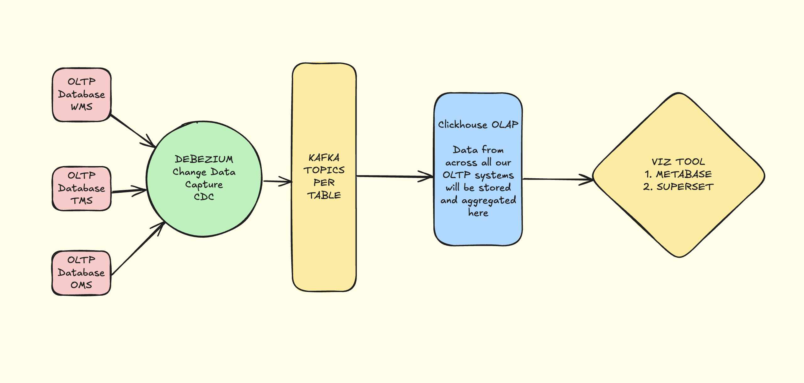

# Insights Infra Setup Guide
## Streaming setup Overviev

This guide provides a step-by-step walkthrough to set up a streaming pipeline from an OLTP database to Kafka and finally to ClickHouse using Debezium, Kafka Connect, and the ClickHouse Sink Connector in a Kubernetes environment.



---

## Table of Contents
1. [Step 1: Deploy Kafka Connect with Debezium](#step-1-deploy-kafka-connect-with-debezium)
2. [Step 2: Deploy Debezium Source Connector for PostgreSQL](#step-2-deploy-debezium-source-connector-for-postgresql)
3. [Step 3: Deploy ClickHouse](#step-3-deploy-clickhouse)
4. [Step 4: Deploy ClickHouse Sink Connector](#step-4-deploy-clickhouse-sink-connector)
5. [Step 5: Verify the Setup](#step-5-verify-the-setup)
6. [Step 6: ClickHouse Integration in Metabase (Kubernetes)](#step-6-clickhouse-integration-in-metabase-kubernetes)
7. [Documentation Reference](#documentation-reference)
---

## Step 1: Create a Custom Kafka Connect Image with Required Plugins

To use the `io.debezium.connector.postgresql.PostgresConnector` and `com.clickhouse.kafka.connect.ClickHouseSinkConnector` in your Kafka Connect setup, you need to create a custom Docker image with these plugins. You can use the Dockerfile provided in the following repository as a reference:


- [Reference Dockerfile](https://github.com/stackbox-dev/devops-edge-replication/blob/9d996eb04ce22fc8a1c312dfc61c7a088be1448e/kafka-apps/connect/Dockerfile)

### 1.1 Steps to Build and Deploy the Custom Image
1. Clone the Repository: Clone the repository containing the Dockerfile:
   ```bash
   git clone https://github.com/stackbox-dev/devops-edge-replication.git
   cd devops-edge-replication/kafka-apps/connect
   ```
2. Build the Docker Image: Use the provided Dockerfile to build the custom Kafka Connect image
   ```bash
   docker buildx build --platform linux/amd64 -t asia-docker.pkg.dev/sbx-ci-cd/public/devops-replication-kafka-connect:latest .
   ```
3. Push the Image to a Container Registry (Optional): If you are using a container registry (e.g., Docker Hub, Google Container Registry), push the image:
   ```bash
   docker push asia-docker.pkg.dev/sbx-ci-cd/public/devops-replication-kafka-connect:latest
   ```
4. Update the Kubernetes Deployment: Modify your Kafka Connect deployment YAML to use the custom image.

### 1.2 Deploy Kafka Connect with Debezium

Kafka Connect is required to run both Debezium (for Change Data Capture) and the ClickHouse Sink Connector (for storing data in ClickHouse).

1. Create a `kafka-connect.yaml` file with the necessary configurations for Kafka Connect.
2. Apply the manifest to your Kubernetes cluster:

   ```bash
   kubectl apply -f kafka/kafka-connect.yaml
   ```

Verify the Plugins: Once the Kafka Connect pod is running, verify that the plugins are available:

You should see both `io.debezium.connector.postgresql.PostgresConnector` and `com.clickhouse.kafka.connect.ClickHouseSinkConnector` in the list of available plugins.

---

## Step 2: Deploy Debezium Source Connector for PostgreSQL

Debezium monitors PostgreSQL and publishes changes to Kafka.

### 2.1 Enable Logical Replication in PostgreSQL

Run the following SQL commands in your PostgreSQL database to enable logical replication:

```sql
ALTER SYSTEM SET wal_level = logical;
ALTER SYSTEM SET max_replication_slots = 10;
ALTER SYSTEM SET max_wal_senders = 10;
SELECT pg_reload_conf();
```

Create a replication user:

```sql
CREATE USER debezium WITH REPLICATION ENCRYPTED PASSWORD '<your_password>';
GRANT USAGE ON SCHEMA public TO debezium;
GRANT SELECT ON ALL TABLES IN SCHEMA public TO debezium;
ALTER DEFAULT PRIVILEGES IN SCHEMA public GRANT SELECT ON TABLES TO debezium;
GRANT SELECT ON ALL SEQUENCES IN SCHEMA public TO debezium;
ALTER DEFAULT PRIVILEGES IN SCHEMA public GRANT ALL ON SEQUENCES TO debezium;
```

### 2.2 Create a Logical Replication Slot

Create a publication for the tables you want to monitor:

```sql
-- this is a sample sql to create publication on selected tables

CREATE PUBLICATION dbz_publication
FOR TABLE 
public.table_name1,
public.table_name2,
public.table_name3;
```

Adding tables to an Existing PostgreSQL Publication

To add more tables to your existing dbz_publication, you can use the ALTER PUBLICATION command:

```sql
ALTER PUBLICATION dbz_publication 
ADD TABLE public.new_table_name1, public.new_table_name2;
```
Replace `new_table_name1` and `new_table_name2` with the actual names of the tables you want to add.

How to Remove Tables from Publication
```sql
ALTER PUBLICATION dbz_publication DROP TABLE public.table_name;
```
Replace `table_name` with the actual names of the tables you want to drop from publication.

Verify the replication slots and publications:

```sql
SELECT * FROM pg_replication_slots;
SELECT * FROM pg_publication;
```

To clean up, use:

```sql
SELECT pg_drop_replication_slot('dbz');
DROP PUBLICATION dbz_publication;
```

### 2.3 Deploy Debezium Connector

1. Create a `debezium-postgres.json` file with the connector configuration.
2. To capture all tables in the database, use:

   ```json
   "table.include.list": "public.*"
   ```

   Or remove this line entirely to capture all tables by default.

3. Deploy the connector using sample config:

   ```bash
   # this is just a example command to add connector
   curl -X POST http://localhost:8083/connectors -H "Content-Type: application/json" -d @kafka/samples/debezium-postgres.json
   ```

   To update the connector:

   ```bash
    # this is just a example command to update connector
   curl -X PUT http://localhost:8083/connectors/postgres-source/config \
        -H "Content-Type: application/json" \
        -d @kafka/samples/debezium-postgres-update.json
   ```

   To delete the connector:

   ```bash
   # this is just a example command to delete connector
   curl -X DELETE http://localhost:8083/connectors/postgres-source
   ```
---

## Step 3: Deploy ClickHouse

ClickHouse will store the data streamed from Kafka.

### 3.1 Deploy ClickHouse

1. Create a `clickhouse.yaml` file with the necessary configurations.
2. Use Helm to deploy ClickHouse:

   ```bash
   helm show values oci://registry-1.docker.io/bitnamicharts/clickhouse --version 8.0.10 > clickhouse/helm/values.yaml

   helm install clickhouse oci://registry-1.docker.io/bitnamicharts/clickhouse -f clickhouse/helm/values.yaml --version 8.0.10 -n kafka

   helm upgrade clickhouse oci://registry-1.docker.io/bitnamicharts/clickhouse -f clickhouse/helm/values.yaml --version 8.0.10 -n kafka
   ```

---

## Step 4: Deploy ClickHouse Sink Connector

The ClickHouse Sink Connector pulls data from Kafka and inserts it into ClickHouse.

### 4.1 Create a Table in ClickHouse

Run the following SQL in ClickHouse to create a table:

```bash
# This is a sample query to create tables in clickhouse

CREATE DATABASE sbx;

CREATE TABLE sbx.wms (
    id Int64,
    name String,
    created_at DateTime
    updatedAt DateTime
) ENGINE = ReplacingMergeTree(updatedAt)
ORDER BY (name, id);
```
Create all required tables using SQL queries given in `sql-queries` folder.

### 4.2 Deploy ClickHouse Sink Connector

1. Create a `clickhouse-sink.json` file with the connector configuration.
2. Ensure all `topics` and `topic2TableMap` are present.
3. Deploy the connector:

   ```bash
   curl -X POST http://localhost:8083/connectors -H "Content-Type: application/json" -d @clickhouse/samples/clickhouse-sink.json
   ```

   To update the connector:

   ```bash
   curl -X PUT http://localhost:8083/connectors/samples/clickhouse-connect/config \
        -H "Content-Type: application/json" \
        -d @clickhouse/clickhouse-sink-update.json
   ```

   To delete the connector:

   ```bash
   curl -X DELETE http://localhost:8083/connectors/clickhouse-connect
   ```

---

## Step 5: Verify the Setup

### 5.1 Check Kafka Topics

List all Kafka topics:

```bash
kubectl exec -it <kafka-pod-name> -n dev -- kafka-topics.sh --list --bootstrap-server <kafka-url>:9092
```

You should see a topic like `postgres.public.your_table`.

### 5.2 Consume Messages from Kafka

Consume messages from a Kafka topic:

```bash
kubectl exec -it <kafka-pod-name> -n dev -- kafka-console-consumer.sh --topic postgres.public.ccs_cedge --from-beginning --bootstrap-server <kafka-url>:9092
```

### 5.3 Verify Data in ClickHouse

Query the data in ClickHouse:

```bash
clickhouse-client --host clickhouse --query "SELECT * FROM your_db.your_table;"
```

### 5.4 Check Number of Threads

Run the following query to check the number of threads:

```sql
SELECT
    name,
    value
FROM system.settings
WHERE name = 'max_threads';
```

---

## Step 6: ClickHouse Integration in Metabase (Kubernetes)

Metabase is an easy-to-use, open-source UI tool for asking questions about your data. It connects to ClickHouse using a JDBC driver. Follow these steps to deploy Metabase in a Kubernetes environment and integrate it with ClickHouse.

### 6.1 Deploy Metabase in Kubernetes

1. Download the latest ClickHouse plugin JAR using initContainer and mount the plugin via a shared volume:

   ```yaml
   apiVersion: apps/v1
   kind: Deployment
   metadata:
     name: metabase
     labels:
       app: metabase
   spec:
     replicas: 1
     selector:
       matchLabels:
         app: metabase
     template:
       metadata:
         labels:
           app: metabase
       spec:
         containers:
           - name: metabase
             image: metabase/metabase:latest
             ports:
               - containerPort: 3000
             volumeMounts:
               - name: plugins
                 mountPath: /plugins
             env:
               - name: MB_PLUGINS_DIR
                 value: "/plugins"
         initContainers:
           - name: download-clickhouse-plugin
             image: curlimages/curl:latest
             command:
               [
                 "sh",
                 "-c",
                 "curl -L https://github.com/clickhouse/metabase-clickhouse-driver/releases/latest/download/clickhouse.metabase-driver.jar    -o /plugins/clickhouse.metabase-driver.jar"
               ]
             volumeMounts:
               - name: plugins
                 mountPath: /plugins
         volumes:
           - name: plugins
             emptyDir: {}
   
   ```

2. Apply the deployment and wait for metabase pod to load new driver.

3. Access Metabase and use driver.

### 6.2 Add ClickHouse as a Data Source in Metabase

1. Open the Metabase UI in your browser (`https://<EXTERNAL-URL>`).
2. Go to **Settings** > **Admin** > **Databases**.
3. Click **Add Database**.
4. Fill in the following details:
   - **Database Type**: Select `ClickHouse`.
   - **Host**: Enter the hostname or IP address of your ClickHouse service.
   - **Port**: Enter the ClickHouse port (default is `8123`). 
   - **Database Name**: Enter the name of your ClickHouse database (e.g., `sbx`).
   - **Username**: Enter your ClickHouse username.
   - **Password**: Enter your ClickHouse password.
5. Click **Save** to add the database.

---

### 6.4 Start Querying Data

Once the database is added, you can start creating dashboards, visualizations, and asking questions about your data in ClickHouse using Metabase.

---

## Notes

- Ensure all Kubernetes resources are properly configured and deployed.
- Use secure credentials and secrets for sensitive configurations.
- Monitor the pipeline for errors and performance bottlenecks.

## Documentation Reference

- [Kafka Client Authentication for Google Cloud](https://cloud.google.com/managed-service-for-apache-kafka/docs/authentication-kafka#configure-kafka-client)
- [ClickHouse Kafka Connect Sink](https://clickhouse.com/docs/integrations/kafka/clickhouse-kafka-connect-sink)
- [PostgreSQL Interface](https://clickhouse.com/docs/interfaces/postgresql)
- [Avoid Nullable Columns](https://clickhouse.com/docs/optimize/avoid-nullable-columns)
- [Optimizing Types](https://clickhouse.com/docs/data-modeling/schema-design#optimizing-types)
- [Denormalizing Data](https://clickhouse.com/docs/data-modeling/denormalization)
- [Connecting Metabase to ClickHouse](https://clickhouse.com/docs/integrations/metabase)
- [I've operated petabyte-scale ClickHouse® clusters for 5 years](https://www.tinybird.co/blog-posts/what-i-learned-operating-clickhouse)
- [Using Materialized Views in ClickHouse](https://clickhouse.com/blog/using-materialized-views-in-clickhouse)
- [Materialized Views and JOINs](https://clickhouse.com/docs/materialized-view/incremental-materialized-view#materialized-views-and-joins)
- [Conditional Functions](https://clickhouse.com/docs/sql-reference/functions/conditional-functions)
---